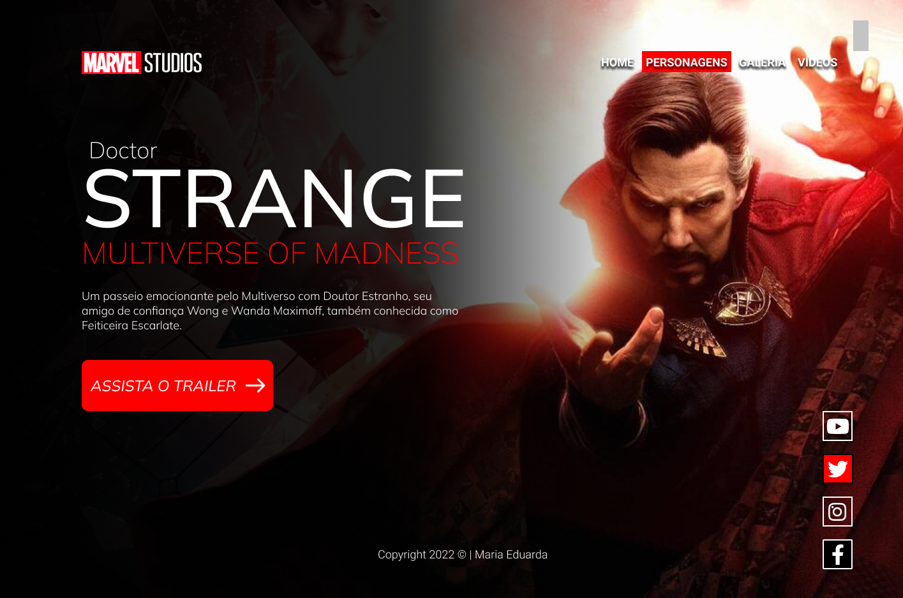
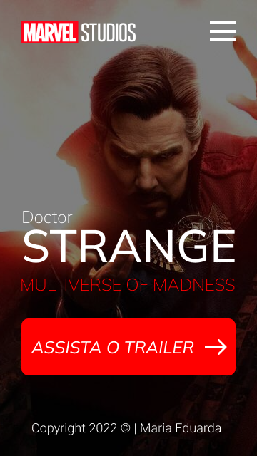

# Doctor-Strange
Projeto construído durante as aulas de LIMA, no curso de desenvolvimento de sistemas do [SENAI Jandira](https://jandira.sp.senai.br/), com orientação do Prof. [Fernando Leonid](https://github.com/fernandoleonid)

 

---
## Qual era o objetivo do projeto?
O objetivo era criar uma landing page com base no design feito no figma, aprendendo a estrutura do HTML, CSS, JS e conceitos de responsividade.

---
## O que é uma Landing Page?
Landing Page são páginas com foco principal na conversão de visitantes, assim, essas páginas possuem uma estetica mais minimalistas comparada com os sites tradicionais.

---
## Tecnologias usadas
- HTML 5
- CSS 3
- JavaScript
- Figma

---
## Links
- [Veja o projeto inicial no figma](https://www.figma.com/file/SCcLeHaeU9v2Ge3q4FZqjj/LIMA---STRANGE?node-id=1%3A56)
- [Veja o resultado final](https://maria-efs.github.io/Doctor-Strange/) 

---
## Autor
[Maria Eduarda Fernandes](https://github.com/Maria-efs)